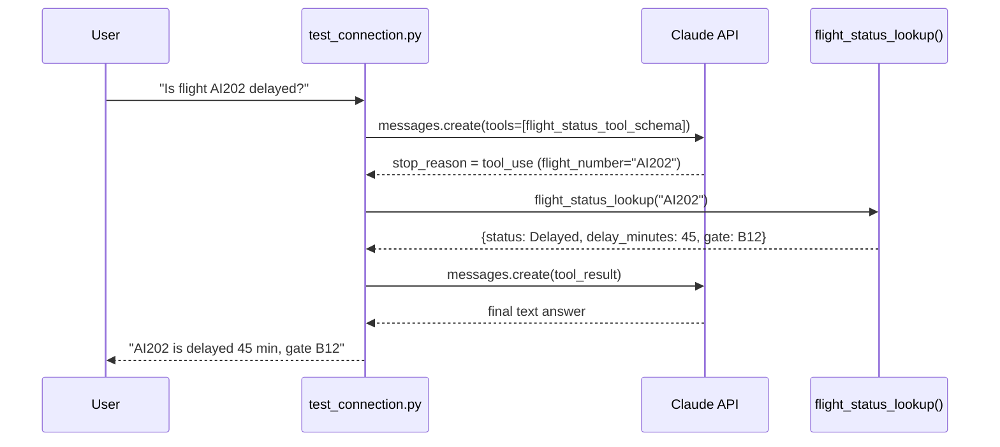

# Airline AI Platform

An early-stage platform that uses Claude's tool-use (function calling) to answer
airline questions — e.g. flight status — by letting Claude call real backend
functions instead of guessing.

## How it works

Claude is offered a **tool schema** describing a Python function it can request.
When it decides the question needs live data, it returns a `tool_use` block
instead of an answer; the app runs the real function locally, sends the result
back, and Claude uses it to write the final answer.



## Project structure

```mermaid
flowchart TD
    subgraph root[" "]
        TC[test_connection.py]
    end

    subgraph src/config
        SET[settings.py<br/><i>loads ANTHROPIC_API_KEY</i>]
    end

    subgraph src/tools
        FS[flight_status.py<br/><i>flight_status_lookup&#40;&#41;<br/>flight_status_tool_schema</i>]
    end

    subgraph src/agents["src/agents (planned)"]
        AG[" "]
    end

    subgraph src/orchestration["src/orchestration (planned)"]
        OR[" "]
    end

    TC -->|reads API key| SET
    TC -->|imports tool + schema| FS
    TC -.->|future| AG
    TC -.->|future| OR
```



- **`src/config/settings.py`** — loads `ANTHROPIC_API_KEY` from `.env`.
- **`src/tools/flight_status.py`** — a mock flight-status lookup and the
  Anthropic tool schema describing it to Claude.
- **`src/agents/`, `src/orchestration/`** — scaffolding for future multi-agent
  orchestration; currently empty.
- **`test_connection.py`** — end-to-end smoke test: sends a question, lets
  Claude call the flight-status tool, and prints the final answer.

## Setup

1. Install dependencies:
   ```bash
   pip install anthropic python-dotenv
   ```
2. Create a `.env` file in the project root:
   ```
   ANTHROPIC_API_KEY=your-key-here
   ```

## Run

```bash
python3 test_connection.py
```
