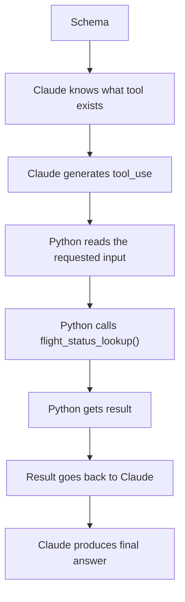
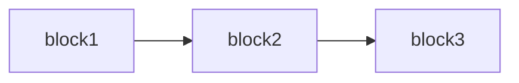
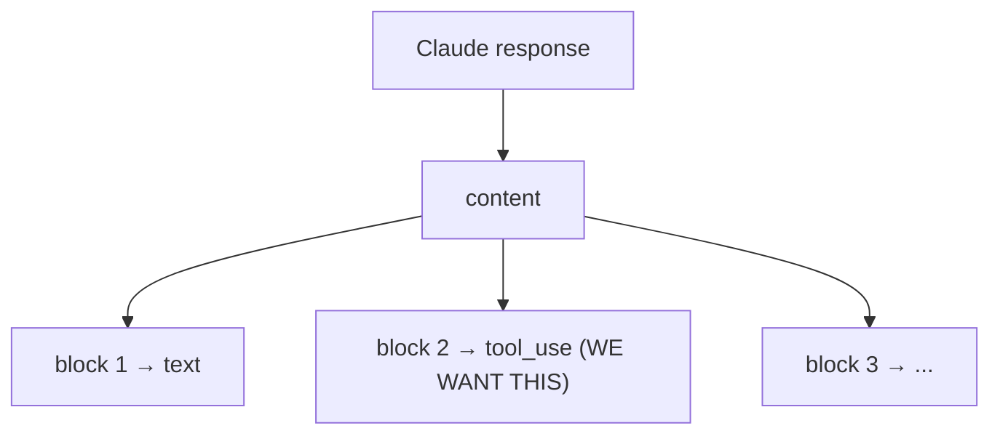
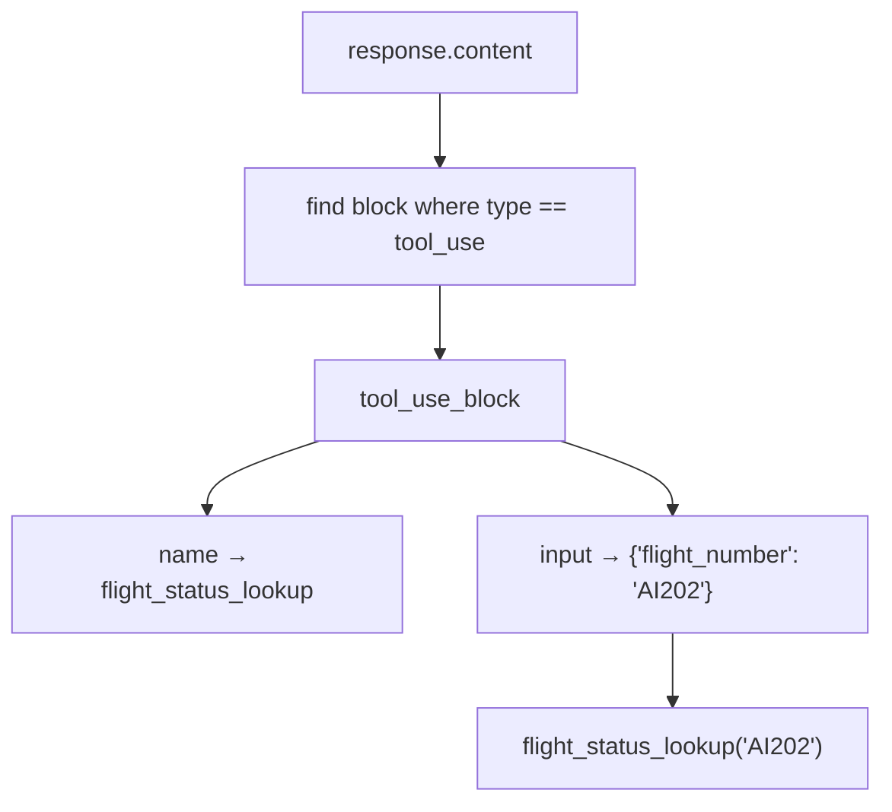
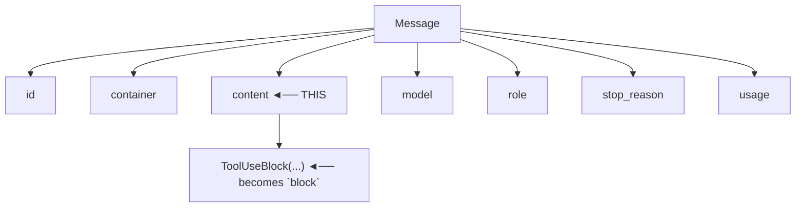
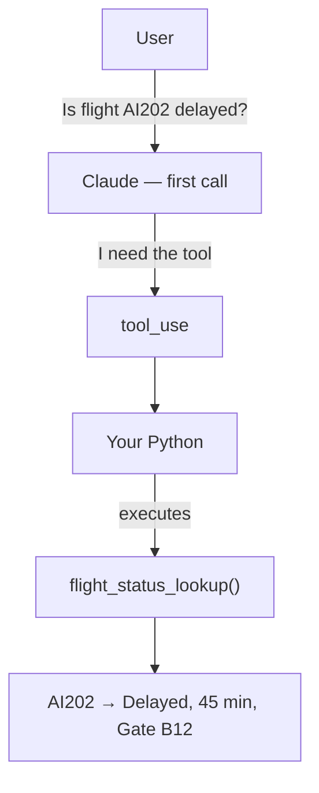
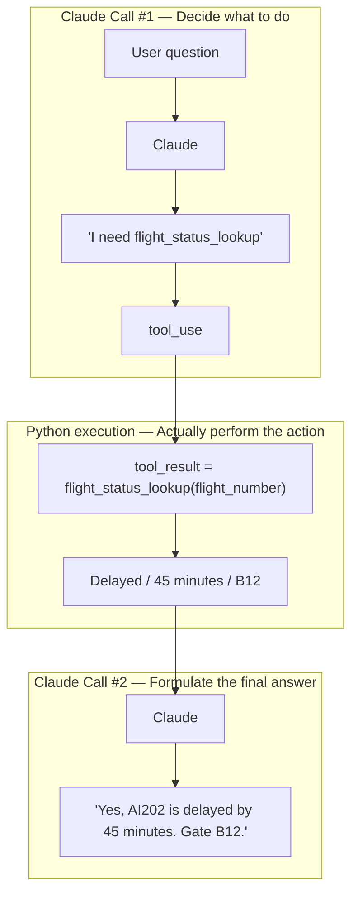
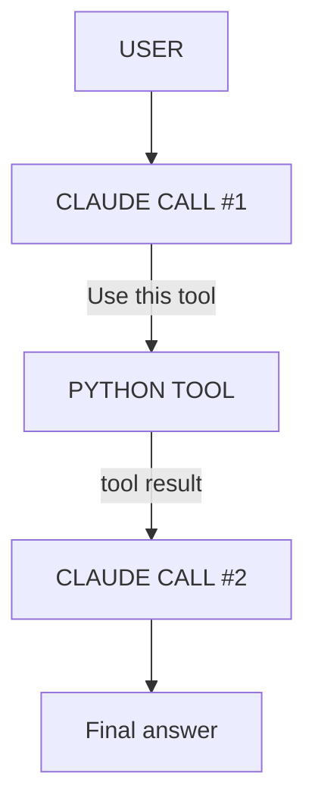
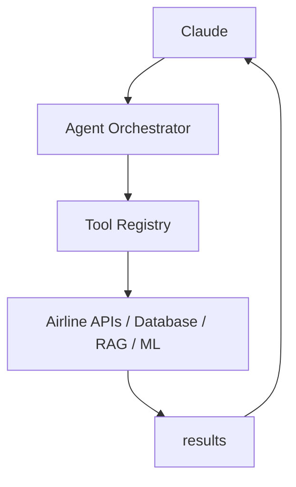
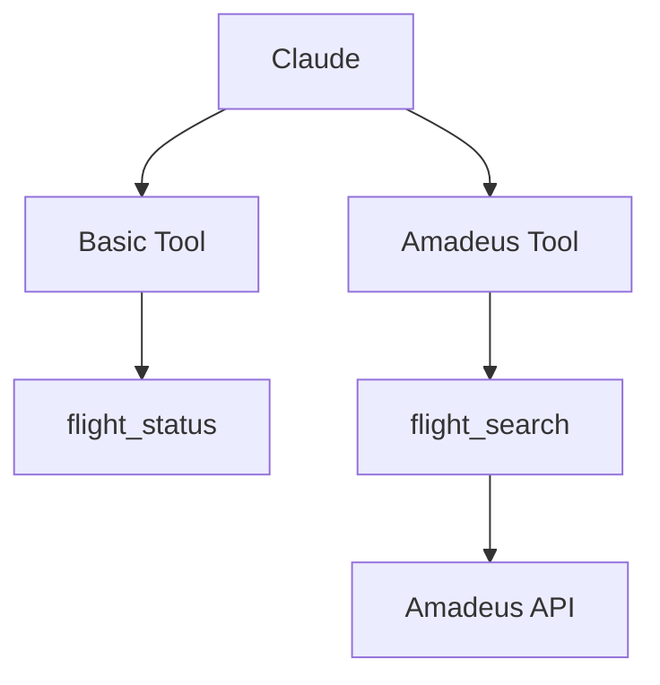

# Running Notes — Claude Tool Use

## 1. The three important locations

There are three different things to distinguish:

| # | What | Where |
|---|------|-------|
| 1 | Schema definition | `flight_status.py` — `flight_status_tool_schema: ToolParam = {...}` |
| 2 | Schema given to Claude | `test_connection.py` — `tools=[flight_status_tool_schema]` |
| 3 | Actual Python function execution | `test_connection.py` — `tool_result = flight_status_lookup(flight_number)` |

### The overall flow



This version specifically addresses the two Pylance errors already encountered.

---

## 2. Understanding `tool_use_block = next(...)`

```python
tool_use_block = next(
    block
    for block in response.content
    if block.type == "tool_use"
)
```

This is an important line because it sits right at the boundary between Claude's response and the Python code. Let's go slowly.

### 2.1 What is `response.content`?

Earlier we did:

```python
response = client.messages.create(...)
```

Claude sends back a response, and that response can contain different types of blocks. For example, for the question *"Is flight AI202 delayed?"*, Claude may decide it needs to use `flight_status_lookup`, so the response could contain a `tool_use` block conceptually like:

```python
response.content
[
    TextBlock(...),
    ToolUseBlock(...)
]
```

### 2.2 `for block in response.content`

This means: go through every block inside Claude's response.



### 2.3 `if block.type == "tool_use"`

For every block, we ask: *is this block a tool_use block?*

- `block1.type = "text"` → not what we're looking for
- `block2.type = "tool_use"` → ✅ that's the one we want

### 2.4 What does `next()` do?

`next(...)` means: *give me the first item that matches what I'm looking for.*

So the full expression means: *search through `response.content` and give me the first block whose type is `"tool_use"`.*

### 2.5 The long-form equivalent

```python
tool_use_block = None

for block in response.content:
    if block.type == "tool_use":
        tool_use_block = block
        break
```

Step by step:

1. `tool_use_block = None` — start with nothing.
2. `for block in response.content:` — look at each Claude response block.
3. `if block.type == "tool_use":` — check whether this is the tool request.
4. `tool_use_block = block` — save that tool request.
5. `break` — stop searching, we found it.

### 2.6 Why do we need this?

Because Claude's response isn't necessarily just a `tool_use` block and nothing else — it's a collection of content blocks:



We need to locate that specific `tool_use` block. So `next(...)` is basically saying:

> "Claude, give me the first tool request you generated." 😄

### 2.7 Once we have `tool_use_block`

```python
print(tool_use_block.name)
# flight_status_lookup

print(tool_use_block.input)
# {"flight_number": "AI202"}
```

Then we extract:

```python
flight_number = str(tool_use_block.input["flight_number"])
tool_result = flight_status_lookup(flight_number)
```

### 2.8 The entire chain



### 2.9 One Python concept to remember

```python
next(
    item
    for item in collection
    if condition
)
```

Means: *find the first item in `collection` that satisfies `condition`.* This pattern shows up all over Python, not just in Agentic AI.

### 2.10 Where is `block` in the real response?

Actual printed Claude response:

```python
Message(
    id='msg_011CeLTqxgDife7mswCcwgQo',
    container=None,
    content=[
        ToolUseBlock(
            id='toolu_01VZAn2kTfyxsrP8c7oZhs9Y',
            caller=DirectCaller(type='direct'),
            input={'flight_number': 'AI202'},
            name='flight_status_lookup',
            type='tool_use',
            toolset_name=None
        )
    ],
    model='claude-sonnet-4-5-20250929',
    role='assistant',
    stop_reason='tool_use',
    ...
)
```



Since there is one item in that list, Python assigns it to the loop variable `block`. At that moment `block` is essentially:

```python
ToolUseBlock(
    id='toolu_01VZAn2kTfyxsrP8c7oZhs9Y',
    input={'flight_number': 'AI202'},
    name='flight_status_lookup',
    type='tool_use'
)
```

Read the `next()` line like English: *go through every block inside `response.content`; if the block's type is `"tool_use"`, return that block.* The condition `block.type == "tool_use"` evaluates to `"tool_use" == "tool_use"` → ✅ `True`, so `tool_use_block = block`.

Now:

```python
tool_use_block.name    # flight_status_lookup
tool_use_block.input   # {"flight_number": "AI202"}
tool_use_block.input["flight_number"]  # AI202
flight_status_lookup("AI202")          # executes the function
```

### 2.11 The key concept

`block` is **not** something Claude created — it's just a Python loop variable name. This would work identically:

```python
for xyz in response.content:
    print(xyz)

for response_item in response.content:
    print(response_item)
```

`for block in response.content` simply means: *"For each item in Claude's content list, temporarily call that item `block`."*

---

## 3. Why do we call Claude twice?

> Q: Why call Claude again for the final response — we already called it at the start?

The answer: **the first Claude call doesn't have the flight result yet.** This is the most important concept in the whole tool-calling flow.

### 3.1 First Claude call

```python
response = client.messages.create(...)
```

At this point Claude knows the user's question ("Is flight AI202 delayed?") and the available tool (`flight_status_lookup`). Claude thinks: *"I need the flight status, I'll request the tool."* It returns a `tool_use` block — it has **not** received the actual flight status yet.

### 3.2 Python executes the tool

```python
tool_result = flight_status_lookup("AI202")
# {"status": "Delayed", "delay_minutes": 45, "gate": "B12"}
```

Now Python knows the answer, but Claude doesn't.



At this point: Python knows the result ✅, Claude doesn't know the result yet ❌.

### 3.3 Therefore we call Claude again

```python
final_response = client.messages.create(
    ...,
    # includes:
    {
        "type": "tool_result",
        "tool_use_id": tool_use_block.id,
        "content": str(tool_result),
    }
)
```

This isn't simply repeating the first call — we're giving Claude the missing information: *"You asked me to run `flight_status_lookup` for AI202. I ran it. Here is the result."*

Claude now receives the user's question, its own previous response, and the tool result — and can finally answer.

### 3.4 Why there are two Claude calls



### 3.5 Why can't Python just answer the user?

It could — `print(tool_result)` gives `{'status': 'Delayed', 'delay_minutes': 45, 'gate': 'B12'}`, but that's not very user-friendly. Claude turns structured data into a natural response:

> "Yes, flight AI202 is delayed by 45 minutes. The current gate is B12."

And later, Claude can do much more sophisticated reasoning.

### 3.6 The fundamental Agentic pattern



### 3.7 The critical insight

**Claude does not execute your Python tool. Your application is the orchestrator between Claude and the tool.**

This simple example is teaching the foundation of an Agentic AI architecture. Later, instead of `Claude → Python function`, we'll have:



And that's where the Airline AI Platform starts becoming a real Agentic AI system.

---

## 4. Making it realistic — integrating real flight search

> Now lets make it realisic . an we  integrate google fight search?

Yes — and this is exactly the right next step.

We can replace our fake:

```python
fake_db = {
    "AI202": ...
}
```

with a real flight-search capability. One important distinction first:

### 4.1 Google Flights itself

We shouldn't try to scrape the Google Flights website. Google Flights doesn't provide a normal public flight-search API that we can simply call from Python.

For a realistic learning project, I recommend this architecture:

```
User
 │
 │ "Find flights Hyderabad → Delhi tomorrow"
 ▼
Claude
 │
 │ decides it needs flight search
 ▼
flight_search tool
 │
 ▼
Real flight-search API
 │
 ▼
Flight results
 │
 ▼
Claude
 │
 ▼
Natural-language recommendation
```

For example, we can use a flight-data provider such as Amadeus for the actual API search, while keeping the interface exposed to Claude as our own: `flight_search(...)`. This is actually better Agentic AI architecture than coupling Claude directly to a third-party API.

### 4.2 Our project would become

```
airline-ai-platform/
│
├── src/
│   ├── config/
│   │   └── settings.py
│   │
│   └── tools/
│       ├── flight_status.py
│       └── flight_search.py       ← NEW
│
└── test_connection.py
```

And the tool schema would eventually look conceptually like:

```python
flight_search_tool_schema = {
    "name": "flight_search",
    "description": "Search available flights between two airports.",
    "input_schema": {
        "type": "object",
        "properties": {
            "origin": {
                "type": "string"
            },
            "destination": {
                "type": "string"
            },
            "departure_date": {
                "type": "string"
            }
        },
        "required": [
            "origin",
            "destination",
            "departure_date"
        ]
    }
}
```

Then Claude could receive: *Find flights from Hyderabad to Delhi on September 5.* and generate something like:

```
tool_use
flight_search

{
    "origin": "HYD",
    "destination": "DEL",
    "departure_date": "2026-09-05"
}
```

Your Python application then calls the real flight API.

### 4.3 But let's do this slowly

I don't want to throw an API integration at you yet. Next step should be choosing the real flight-data provider and setting up its API credentials securely in your existing `settings.py`.

We can investigate the current options and choose one that has a usable developer API/free or trial tier.

We should not touch your existing `flight_status.py` or working `test_connection.py`. We'll add Amadeus as a completely separate integration.

---

## 5. Proposed structure — Amadeus as a separate integration

```
airline-ai-platform/
│
├── src/
│   │
│   ├── config/
│   │   └── settings.py
│   │
│   ├── tools/
│   │   └── flight_status.py          ← EXISTING, DON'T TOUCH
│   │
│   └── integrations/
│       │
│       └── amadeus/
│           ├── __init__.py
│           ├── client.py
│           └── flight_search.py
│
├── test_connection.py                ← EXISTING, DON'T TOUCH
│
└── README.md
```

This gives us a clean separation:

```
tools/
    ↓
Claude-facing tools

integrations/
    ↓
External systems/APIs
```

That's actually an important enterprise architecture principle. Later:

```
Claude
  │
  ├── flight_status tool
  │        ↓
  │   internal/local source
  │
  └── flight_search tool
           ↓
       Amadeus
           ↓
      real flight data
```

### 5.1 Even better

We can eventually have:

```
src/
├── agents/
├── tools/
├── integrations/
│   ├── amadeus/
│   ├── weather/
│   └── payments/
├── orchestration/
└── config/
```

But don't create all of those yet. For now, we'll create only:

```
src/integrations/amadeus/
```

and leave everything you've already built intact.

### 5.2 One important rule for our project

From now on I'll clearly label things:

- 🟢 EXISTING — DON'T CHANGE
- 🔵 NEW — CREATE
- 🟡 MODIFY — ONLY IF WE AGREE

That way you can commit each stage to Git without accidentally breaking previous learning milestones.

Next step: we'll create only the Amadeus folder and its `__init__.py`. No API code yet. Then we'll commit that checkpoint.

---

## 6. Adding Amadeus into the original project hierarchy

> please add this to original project hierrarcy

Yes. Let's keep your original project hierarchy intact and add Amadeus cleanly underneath it.

### 6.1 Updated project hierarchy

```
airline-ai-platform/
│
├── .gitignore
├── README.md
├── test_connection.py
│
└── src/
    │
    ├── config/
    │   └── settings.py
    │
    ├── tools/
    │   └── flight_status.py
    │
    └── integrations/
        │
        └── amadeus/
            ├── __init__.py
            ├── client.py
            └── flight_search.py
```

### 6.2 What each part means

```
src/
│
├── config/
│   └── settings.py
│       └── API keys and configuration
│
├── tools/
│   └── flight_status.py
│       └── Claude-facing tool
│
└── integrations/
    └── amadeus/
        ├── __init__.py
        │   └── Makes this a Python package
        │
        ├── client.py
        │   └── Amadeus API connection
        │
        └── flight_search.py
            └── Actual Amadeus flight-search operation
```

### 6.3 Most importantly

Your existing code remains untouched:

- 🟢 KEEP `src/config/settings.py`
- 🟢 KEEP `src/tools/flight_status.py`
- 🟢 KEEP `test_connection.py`

We're adding:

- 🔵 NEW `src/integrations/amadeus/`

### 6.4 The eventual architecture will be

```
                     Claude
                       │
                ┌──────┴──────┐
                │              │
                ▼              ▼
        flight_status     flight_search
             tool              tool
                │              │
                ▼              ▼
          Existing          Amadeus
          function            API
                              │
                              ▼
                       Real flight data
```

Don't write the Amadeus code yet. The next step should be creating just the directory and `__init__.py`, then we'll understand why we're separating tools from external integrations before writing the API client.

---

## 7. Complete project hierarchy (checkpoint)

```
airline-ai-platform/
│
├── 🟢 BASIC / EXISTING — DO NOT CHANGE
│
├── .qodo/
│
├── .venv/
│
├── venv/
│
├── docs/
│
├── src/
│   │
│   ├── agents/
│   │
│   ├── config/
│   │   ├── __pycache__/
│   │   └── settings.py
│   │
│   ├── orchestration/
│   │
│   ├── tools/
│   │   ├── __pycache__/
│   │   └── flight_status.py
│   │
│   └── 🔵 integrations/                 ← NEW
│       │
│       └── 🔵 amadeus/                  ← NEW
│           ├── __init__.py               ← NEW
│           ├── client.py                 ← NEW
│           └── flight_search.py          ← NEW
│
├── .env
├── .gitignore
├── basicrunning....                     🟢 EXISTING
├── README.md                            🟢 EXISTING
└── test_connection.py                   🟢 EXISTING
```

### 7.1 🟢 BASIC — untouched

Your existing foundation stays exactly as it is:

```
src/
├── agents/
├── config/
│   └── settings.py
├── orchestration/
└── tools/
    └── flight_status.py

test_connection.py
```

We will not modify these files for the Amadeus work. Your current working flow remains:

```
User
 ↓
Claude
 ↓
flight_status_tool_schema
 ↓
tool_use
 ↓
flight_status_lookup()
 ↓
tool_result
 ↓
Claude
 ↓
Final answer
```

### 7.2 🔵 AMADEUS — new integration

We're adding this separately:

```
src/
└── integrations/
    └── amadeus/
        ├── __init__.py
        ├── client.py
        └── flight_search.py
```

The responsibility will be:

```
client.py
    ↓
Connect/authenticate with Amadeus

flight_search.py
    ↓
Perform real flight-search operation
```

Later, we'll create a Claude-facing tool that calls this integration. So eventually:

```
                    CLAUDE
                      │
             ┌────────┴────────┐
             │                 │
             ▼                 ▼
      flight_status      flight_search
          TOOL                TOOL
             │                 │
             ▼                 ▼
    flight_status.py     Amadeus integration
                              │
                         ┌────┴────┐
                         │         │
                      client.py   flight_search.py
                         │
                         ▼
                    Amadeus API
```

### 7.3 ⚠️ Important

Do not create `client.py` or `flight_search.py` yet. For our slow-learning approach, our next step should be only:

```
src/integrations/
└── amadeus/
    └── __init__.py
```

Then we will understand why `integrations` is separate from `tools` before writing the first Amadeus API code. That keeps your BASIC foundation untouched while we build the AMADEUS track separately.

---

## 8. Giving Amadeus its own top-level directory

> can we care separate dir for Amadeus tool

Yes — I actually prefer that for this project, especially because you want to learn slowly and keep the original/basic implementation untouched. We can give Amadeus its own complete tool area.

### 8.1 Updated hierarchy

```
airline-ai-platform/
│
├── 🟢 BASIC — EXISTING / DO NOT TOUCH
│
├── .qodo/
├── .venv/
├── venv/
├── docs/
│
├── src/
│   │
│   ├── agents/
│   │
│   ├── config/
│   │   └── settings.py
│   │
│   ├── orchestration/
│   │
│   ├── tools/                         🟢 BASIC TOOLS
│   │   └── flight_status.py
│   │
│   └── amadeus/                       🔵 AMADEUS
│       │
│       ├── tools/                     🔵 Amadeus-facing tools
│       │   └── flight_search.py
│       │
│       ├── client.py                  🔵 Amadeus API client
│       └── __init__.py
│
├── .env
├── .gitignore
├── basicrunning....
├── README.md
└── test_connection.py                 🟢 BASIC
```

### 8.2 Why I like this better

Now the separation is very obvious:

```
🟢 BASIC
src/tools/
└── flight_status.py
```

This is your original learning example. And:

```
🔵 AMADEUS
src/amadeus/
├── client.py
└── tools/
    └── flight_search.py
```

is your real-world airline integration. Eventually:



This also gives you a nice portfolio story: *the platform separates core domain tools from external airline-provider integrations.*

### 8.3 Adding more providers later

```
src/
├── amadeus/
│   └── tools/
│       └── flight_search.py
│
├── sabre/
│   └── tools/
│       └── flight_search.py
│
└── tools/
    └── flight_status.py
```

we can compare providers without disturbing your original code.

### 8.4 Next step

I recommend this structure. For now, create only:

```
src/amadeus/
├── __init__.py
└── tools/
    └── __init__.py
```

Don't write the Amadeus API code yet. We'll do that as the next learning step.
