# Running Notes — Claude Tool Use

## 1. The three important locations

There are three different things to distinguish:

| # | What | Where |
|---|------|-------|
| 1 | Schema definition | `flight_status.py` — `flight_status_tool_schema: ToolParam = {...}` |
| 2 | Schema given to Claude | `test_connection.py` — `tools=[flight_status_tool_schema]` |
| 3 | Actual Python function execution | `test_connection.py` — `tool_result = flight_status_lookup(flight_number)` |

### The overall flow

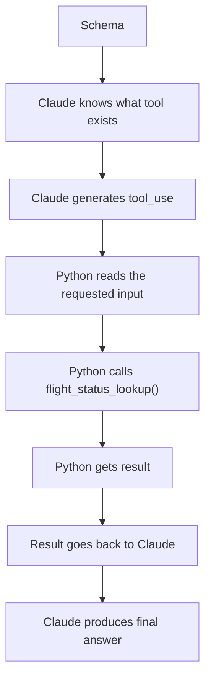

This version specifically addresses the two Pylance errors already encountered.

---

## 2. Understanding `tool_use_block = next(...)`

```python
tool_use_block = next(
    block
    for block in response.content
    if block.type == "tool_use"
)
```

This is an important line because it sits right at the boundary between Claude's response and the Python code. Let's go slowly.

### 2.1 What is `response.content`?

Earlier we did:

```python
response = client.messages.create(...)
```

Claude sends back a response, and that response can contain different types of blocks. For example, for the question *"Is flight AI202 delayed?"*, Claude may decide it needs to use `flight_status_lookup`, so the response could contain a `tool_use` block conceptually like:

```python
response.content
[
    TextBlock(...),
    ToolUseBlock(...)
]
```

### 2.2 `for block in response.content`

This means: go through every block inside Claude's response.

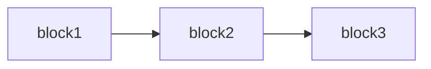

### 2.3 `if block.type == "tool_use"`

For every block, we ask: *is this block a tool_use block?*

- `block1.type = "text"` → not what we're looking for
- `block2.type = "tool_use"` → ✅ that's the one we want

### 2.4 What does `next()` do?

`next(...)` means: *give me the first item that matches what I'm looking for.*

So the full expression means: *search through `response.content` and give me the first block whose type is `"tool_use"`.*

### 2.5 The long-form equivalent

```python
tool_use_block = None

for block in response.content:
    if block.type == "tool_use":
        tool_use_block = block
        break
```

Step by step:

1. `tool_use_block = None` — start with nothing.
2. `for block in response.content:` — look at each Claude response block.
3. `if block.type == "tool_use":` — check whether this is the tool request.
4. `tool_use_block = block` — save that tool request.
5. `break` — stop searching, we found it.

### 2.6 Why do we need this?

Because Claude's response isn't necessarily just a `tool_use` block and nothing else — it's a collection of content blocks:

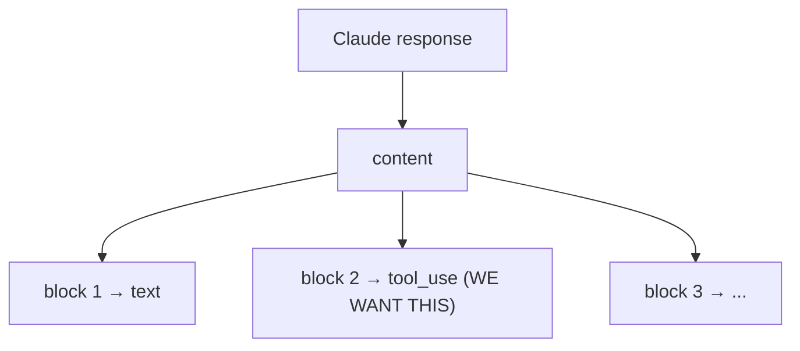

We need to locate that specific `tool_use` block. So `next(...)` is basically saying:

> "Claude, give me the first tool request you generated." 😄

### 2.7 Once we have `tool_use_block`

```python
print(tool_use_block.name)
# flight_status_lookup

print(tool_use_block.input)
# {"flight_number": "AI202"}
```

Then we extract:

```python
flight_number = str(tool_use_block.input["flight_number"])
tool_result = flight_status_lookup(flight_number)
```

### 2.8 The entire chain

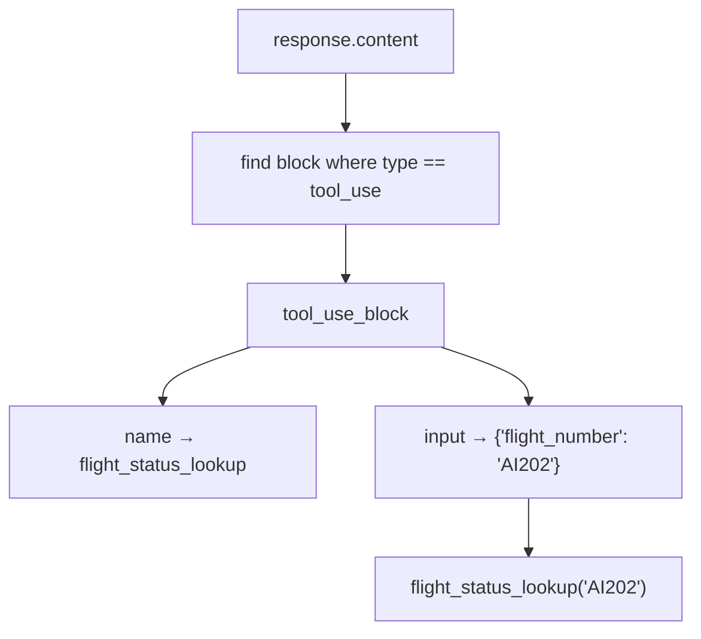

### 2.9 One Python concept to remember

```python
next(
    item
    for item in collection
    if condition
)
```

Means: *find the first item in `collection` that satisfies `condition`.* This pattern shows up all over Python, not just in Agentic AI.

### 2.10 Where is `block` in the real response?

Actual printed Claude response:

```python
Message(
    id='msg_011CeLTqxgDife7mswCcwgQo',
    container=None,
    content=[
        ToolUseBlock(
            id='toolu_01VZAn2kTfyxsrP8c7oZhs9Y',
            caller=DirectCaller(type='direct'),
            input={'flight_number': 'AI202'},
            name='flight_status_lookup',
            type='tool_use',
            toolset_name=None
        )
    ],
    model='claude-sonnet-4-5-20250929',
    role='assistant',
    stop_reason='tool_use',
    ...
)
```

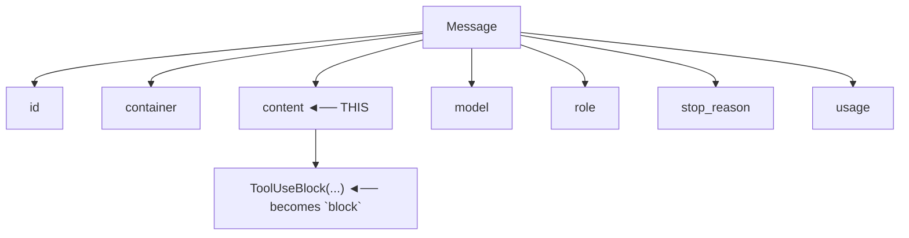

Since there is one item in that list, Python assigns it to the loop variable `block`. At that moment `block` is essentially:

```python
ToolUseBlock(
    id='toolu_01VZAn2kTfyxsrP8c7oZhs9Y',
    input={'flight_number': 'AI202'},
    name='flight_status_lookup',
    type='tool_use'
)
```

Read the `next()` line like English: *go through every block inside `response.content`; if the block's type is `"tool_use"`, return that block.* The condition `block.type == "tool_use"` evaluates to `"tool_use" == "tool_use"` → ✅ `True`, so `tool_use_block = block`.

Now:

```python
tool_use_block.name    # flight_status_lookup
tool_use_block.input   # {"flight_number": "AI202"}
tool_use_block.input["flight_number"]  # AI202
flight_status_lookup("AI202")          # executes the function
```

### 2.11 The key concept

`block` is **not** something Claude created — it's just a Python loop variable name. This would work identically:

```python
for xyz in response.content:
    print(xyz)

for response_item in response.content:
    print(response_item)
```

`for block in response.content` simply means: *"For each item in Claude's content list, temporarily call that item `block`."*

---

## 3. Why do we call Claude twice?

> Q: Why call Claude again for the final response — we already called it at the start?

The answer: **the first Claude call doesn't have the flight result yet.** This is the most important concept in the whole tool-calling flow.

### 3.1 First Claude call

```python
response = client.messages.create(...)
```

At this point Claude knows the user's question ("Is flight AI202 delayed?") and the available tool (`flight_status_lookup`). Claude thinks: *"I need the flight status, I'll request the tool."* It returns a `tool_use` block — it has **not** received the actual flight status yet.

### 3.2 Python executes the tool

```python
tool_result = flight_status_lookup("AI202")
# {"status": "Delayed", "delay_minutes": 45, "gate": "B12"}
```

Now Python knows the answer, but Claude doesn't.

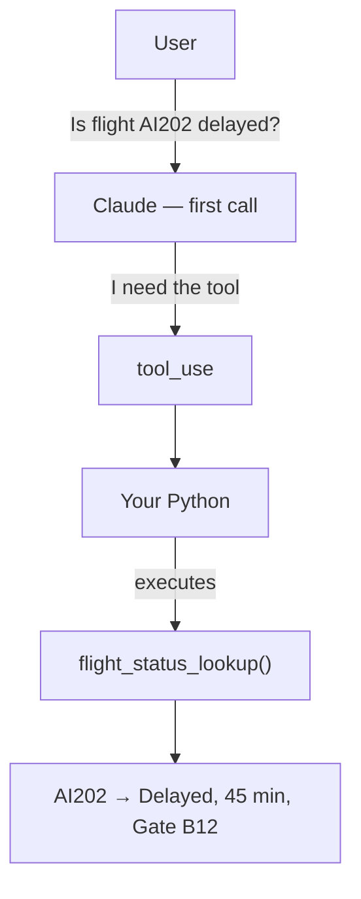

At this point: Python knows the result ✅, Claude doesn't know the result yet ❌.

### 3.3 Therefore we call Claude again

```python
final_response = client.messages.create(
    ...,
    # includes:
    {
        "type": "tool_result",
        "tool_use_id": tool_use_block.id,
        "content": str(tool_result),
    }
)
```

This isn't simply repeating the first call — we're giving Claude the missing information: *"You asked me to run `flight_status_lookup` for AI202. I ran it. Here is the result."*

Claude now receives the user's question, its own previous response, and the tool result — and can finally answer.

### 3.4 Why there are two Claude calls

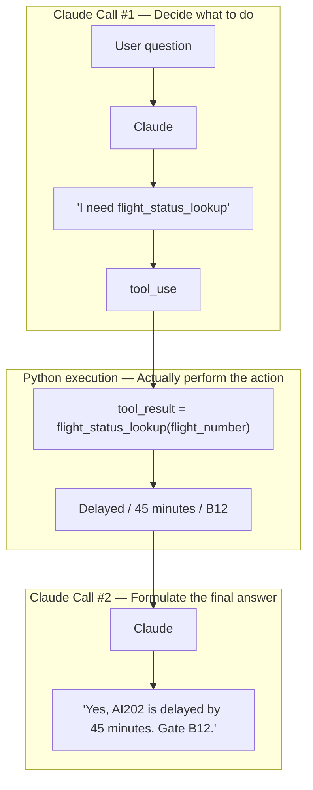

### 3.5 Why can't Python just answer the user?

It could — `print(tool_result)` gives `{'status': 'Delayed', 'delay_minutes': 45, 'gate': 'B12'}`, but that's not very user-friendly. Claude turns structured data into a natural response:

> "Yes, flight AI202 is delayed by 45 minutes. The current gate is B12."

And later, Claude can do much more sophisticated reasoning.

### 3.6 The fundamental Agentic pattern

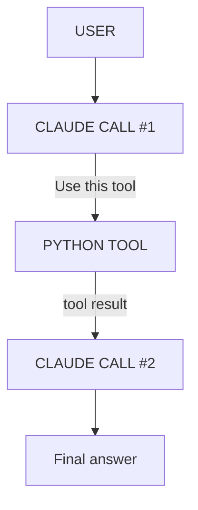

### 3.7 The critical insight

**Claude does not execute your Python tool. Your application is the orchestrator between Claude and the tool.**

This simple example is teaching the foundation of an Agentic AI architecture. Later, instead of `Claude → Python function`, we'll have:

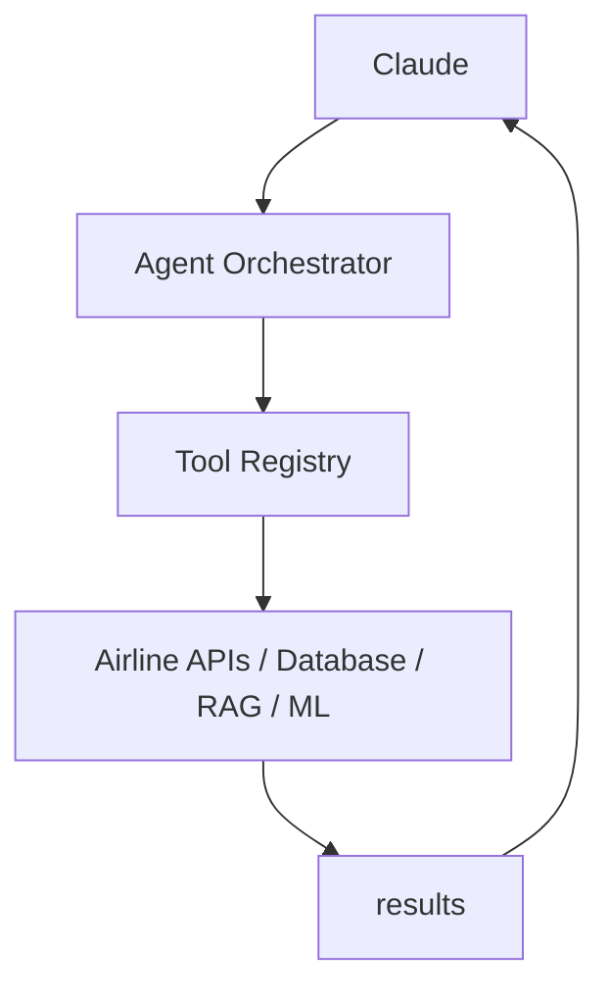

And that's where the Airline AI Platform starts becoming a real Agentic AI system.

---

## 4. Making it realistic — integrating real flight search

> Now lets make it realisic . an we  integrate google fight search?

Yes — and this is exactly the right next step.

We can replace our fake:

```python
fake_db = {
    "AI202": ...
}
```

with a real flight-search capability. One important distinction first:

### 4.1 Google Flights itself

We shouldn't try to scrape the Google Flights website. Google Flights doesn't provide a normal public flight-search API that we can simply call from Python.

For a realistic learning project, I recommend this architecture:

```
User
 │
 │ "Find flights Hyderabad → Delhi tomorrow"
 ▼
Claude
 │
 │ decides it needs flight search
 ▼
flight_search tool
 │
 ▼
Real flight-search API
 │
 ▼
Flight results
 │
 ▼
Claude
 │
 ▼
Natural-language recommendation
```

For example, we can use a flight-data provider such as Amadeus for the actual API search, while keeping the interface exposed to Claude as our own: `flight_search(...)`. This is actually better Agentic AI architecture than coupling Claude directly to a third-party API.

### 4.2 Our project would become

```
airline-ai-platform/
│
├── src/
│   ├── config/
│   │   └── settings.py
│   │
│   └── tools/
│       ├── flight_status.py
│       └── flight_search.py       ← NEW
│
└── test_connection.py
```

And the tool schema would eventually look conceptually like:

```python
flight_search_tool_schema = {
    "name": "flight_search",
    "description": "Search available flights between two airports.",
    "input_schema": {
        "type": "object",
        "properties": {
            "origin": {
                "type": "string"
            },
            "destination": {
                "type": "string"
            },
            "departure_date": {
                "type": "string"
            }
        },
        "required": [
            "origin",
            "destination",
            "departure_date"
        ]
    }
}
```

Then Claude could receive: *Find flights from Hyderabad to Delhi on September 5.* and generate something like:

```
tool_use
flight_search

{
    "origin": "HYD",
    "destination": "DEL",
    "departure_date": "2026-09-05"
}
```

Your Python application then calls the real flight API.

### 4.3 But let's do this slowly

I don't want to throw an API integration at you yet. Next step should be choosing the real flight-data provider and setting up its API credentials securely in your existing `settings.py`.

We can investigate the current options and choose one that has a usable developer API/free or trial tier.

We should not touch your existing `flight_status.py` or working `test_connection.py`. We'll add Amadeus as a completely separate integration.

---

## 5. Proposed structure — Amadeus as a separate integration

```
airline-ai-platform/
│
├── src/
│   │
│   ├── config/
│   │   └── settings.py
│   │
│   ├── tools/
│   │   └── flight_status.py          ← EXISTING, DON'T TOUCH
│   │
│   └── integrations/
│       │
│       └── amadeus/
│           ├── __init__.py
│           ├── client.py
│           └── flight_search.py
│
├── test_connection.py                ← EXISTING, DON'T TOUCH
│
└── README.md
```

This gives us a clean separation:

```
tools/
    ↓
Claude-facing tools

integrations/
    ↓
External systems/APIs
```

That's actually an important enterprise architecture principle. Later:

```
Claude
  │
  ├── flight_status tool
  │        ↓
  │   internal/local source
  │
  └── flight_search tool
           ↓
       Amadeus
           ↓
      real flight data
```

### 5.1 Even better

We can eventually have:

```
src/
├── agents/
├── tools/
├── integrations/
│   ├── amadeus/
│   ├── weather/
│   └── payments/
├── orchestration/
└── config/
```

But don't create all of those yet. For now, we'll create only:

```
src/integrations/amadeus/
```

and leave everything you've already built intact.

### 5.2 One important rule for our project

From now on I'll clearly label things:

- 🟢 EXISTING — DON'T CHANGE
- 🔵 NEW — CREATE
- 🟡 MODIFY — ONLY IF WE AGREE

That way you can commit each stage to Git without accidentally breaking previous learning milestones.

Next step: we'll create only the Amadeus folder and its `__init__.py`. No API code yet. Then we'll commit that checkpoint.

---

## 6. Adding Amadeus into the original project hierarchy

> please add this to original project hierrarcy

Yes. Let's keep your original project hierarchy intact and add Amadeus cleanly underneath it.

### 6.1 Updated project hierarchy

```
airline-ai-platform/
│
├── .gitignore
├── README.md
├── test_connection.py
│
└── src/
    │
    ├── config/
    │   └── settings.py
    │
    ├── tools/
    │   └── flight_status.py
    │
    └── integrations/
        │
        └── amadeus/
            ├── __init__.py
            ├── client.py
            └── flight_search.py
```

### 6.2 What each part means

```
src/
│
├── config/
│   └── settings.py
│       └── API keys and configuration
│
├── tools/
│   └── flight_status.py
│       └── Claude-facing tool
│
└── integrations/
    └── amadeus/
        ├── __init__.py
        │   └── Makes this a Python package
        │
        ├── client.py
        │   └── Amadeus API connection
        │
        └── flight_search.py
            └── Actual Amadeus flight-search operation
```

### 6.3 Most importantly

Your existing code remains untouched:

- 🟢 KEEP `src/config/settings.py`
- 🟢 KEEP `src/tools/flight_status.py`
- 🟢 KEEP `test_connection.py`

We're adding:

- 🔵 NEW `src/integrations/amadeus/`

### 6.4 The eventual architecture will be

```
                     Claude
                       │
                ┌──────┴──────┐
                │              │
                ▼              ▼
        flight_status     flight_search
             tool              tool
                │              │
                ▼              ▼
          Existing          Amadeus
          function            API
                              │
                              ▼
                       Real flight data
```

Don't write the Amadeus code yet. The next step should be creating just the directory and `__init__.py`, then we'll understand why we're separating tools from external integrations before writing the API client.

---

## 7. Complete project hierarchy (checkpoint)

```
airline-ai-platform/
│
├── 🟢 BASIC / EXISTING — DO NOT CHANGE
│
├── .qodo/
│
├── .venv/
│
├── venv/
│
├── docs/
│
├── src/
│   │
│   ├── agents/
│   │
│   ├── config/
│   │   ├── __pycache__/
│   │   └── settings.py
│   │
│   ├── orchestration/
│   │
│   ├── tools/
│   │   ├── __pycache__/
│   │   └── flight_status.py
│   │
│   └── 🔵 integrations/                 ← NEW
│       │
│       └── 🔵 amadeus/                  ← NEW
│           ├── __init__.py               ← NEW
│           ├── client.py                 ← NEW
│           └── flight_search.py          ← NEW
│
├── .env
├── .gitignore
├── basicrunning....                     🟢 EXISTING
├── README.md                            🟢 EXISTING
└── test_connection.py                   🟢 EXISTING
```

### 7.1 🟢 BASIC — untouched

Your existing foundation stays exactly as it is:

```
src/
├── agents/
├── config/
│   └── settings.py
├── orchestration/
└── tools/
    └── flight_status.py

test_connection.py
```

We will not modify these files for the Amadeus work. Your current working flow remains:

```
User
 ↓
Claude
 ↓
flight_status_tool_schema
 ↓
tool_use
 ↓
flight_status_lookup()
 ↓
tool_result
 ↓
Claude
 ↓
Final answer
```

### 7.2 🔵 AMADEUS — new integration

We're adding this separately:

```
src/
└── integrations/
    └── amadeus/
        ├── __init__.py
        ├── client.py
        └── flight_search.py
```

The responsibility will be:

```
client.py
    ↓
Connect/authenticate with Amadeus

flight_search.py
    ↓
Perform real flight-search operation
```

Later, we'll create a Claude-facing tool that calls this integration. So eventually:

```
                    CLAUDE
                      │
             ┌────────┴────────┐
             │                 │
             ▼                 ▼
      flight_status      flight_search
          TOOL                TOOL
             │                 │
             ▼                 ▼
    flight_status.py     Amadeus integration
                              │
                         ┌────┴────┐
                         │         │
                      client.py   flight_search.py
                         │
                         ▼
                    Amadeus API
```

### 7.3 ⚠️ Important

Do not create `client.py` or `flight_search.py` yet. For our slow-learning approach, our next step should be only:

```
src/integrations/
└── amadeus/
    └── __init__.py
```

Then we will understand why `integrations` is separate from `tools` before writing the first Amadeus API code. That keeps your BASIC foundation untouched while we build the AMADEUS track separately.

---

## 8. Giving Amadeus its own top-level directory

> can we care separate dir for Amadeus tool

Yes — I actually prefer that for this project, especially because you want to learn slowly and keep the original/basic implementation untouched. We can give Amadeus its own complete tool area.

### 8.1 Updated hierarchy

```
airline-ai-platform/
│
├── 🟢 BASIC — EXISTING / DO NOT TOUCH
│
├── .qodo/
├── .venv/
├── venv/
├── docs/
│
├── src/
│   │
│   ├── agents/
│   │
│   ├── config/
│   │   └── settings.py
│   │
│   ├── orchestration/
│   │
│   ├── tools/                         🟢 BASIC TOOLS
│   │   └── flight_status.py
│   │
│   └── amadeus/                       🔵 AMADEUS
│       │
│       ├── tools/                     🔵 Amadeus-facing tools
│       │   └── flight_search.py
│       │
│       ├── client.py                  🔵 Amadeus API client
│       └── __init__.py
│
├── .env
├── .gitignore
├── basicrunning....
├── README.md
└── test_connection.py                 🟢 BASIC
```

### 8.2 Why I like this better

Now the separation is very obvious:

```
🟢 BASIC
src/tools/
└── flight_status.py
```

This is your original learning example. And:

```
🔵 AMADEUS
src/amadeus/
├── client.py
└── tools/
    └── flight_search.py
```

is your real-world airline integration. Eventually:

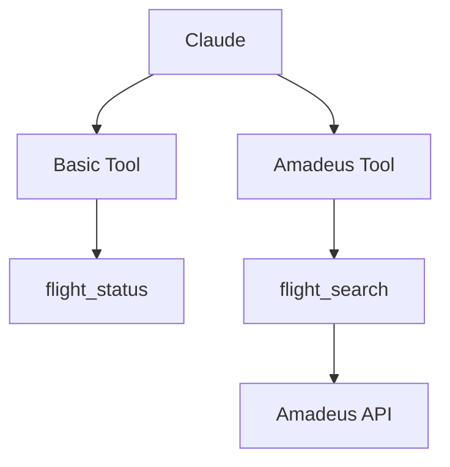

This also gives you a nice portfolio story: *the platform separates core domain tools from external airline-provider integrations.*

### 8.3 Adding more providers later

```
src/
├── Aviation/
│   └── tools/
│       └── flight_search.py
│
├── sabre/
│   └── tools/
│       └── flight_search.py
│
└── tools/
    └── flight_status.py
```

we can compare providers without disturbing your original code.

### 8.4 Next step

I recommend this structure. For now, create only:

```
src/amadeus/
├── __init__.py
└── tools/
    └── __init__.py
```

Don't write the Amadeus API code yet. We'll do that as the next learning step.

---

## 9. Choosing Aviationstack as the real flight-data provider

> how about this Aviationstack: Real-Time Flight Tracker API - Free Flight APIs?

Yes — Aviationstack is actually a very good option for our learning project, and I would consider it before Amadeus.

I checked their current API information. Aviationstack provides real-time flight status data, airport/airline information, routes, historical data, and flight schedules. Their current free plan provides 100 API requests/month and includes real-time flights.

### 9.1 But there is an important distinction

For our project, Aviationstack is excellent for:

- ✈️ Flight status
- ✈️ Flight tracking
- ✈️ Departure / arrival
- ✈️ Delays
- ✈️ Airport information
- ✈️ Airline information
- ✈️ Aircraft information

Their real-time flight data can have updates delayed by roughly 30–60 seconds, according to Aviationstack.

However, I would not treat Aviationstack as a complete flight-booking engine. Our project should separate:

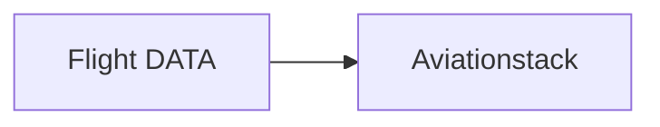

from eventually:

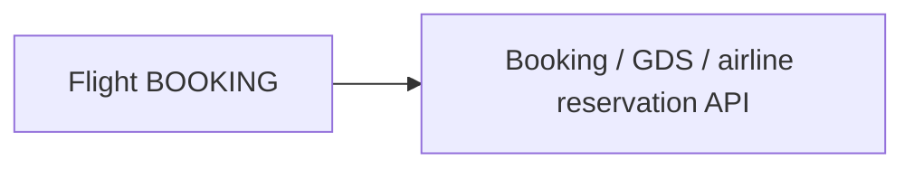

That's actually useful for your AI architecture learning.

### 9.2 I recommend Aviationstack for our next step

Instead of:

```
src/
└── amadeus/
```

I'd make the provider separation even more generic:

```
airline-ai-platform/
│
├── 🟢 BASIC — EXISTING
│
├── src/
│   ├── agents/
│   │
│   ├── config/
│   │   └── settings.py
│   │
│   ├── orchestration/
│   │
│   ├── tools/
│   │   └── flight_status.py
│   │
│   └── 🔵 integrations/
│       │
│       └── 🔵 aviationstack/
│           ├── __init__.py
│           ├── client.py
│           └── tools/
│               ├── __init__.py
│               └── flight_search.py
│
├── .env
├── .gitignore
├── README.md
└── test_connection.py
```

And your existing code remains untouched.

### 9.3 The architecture becomes

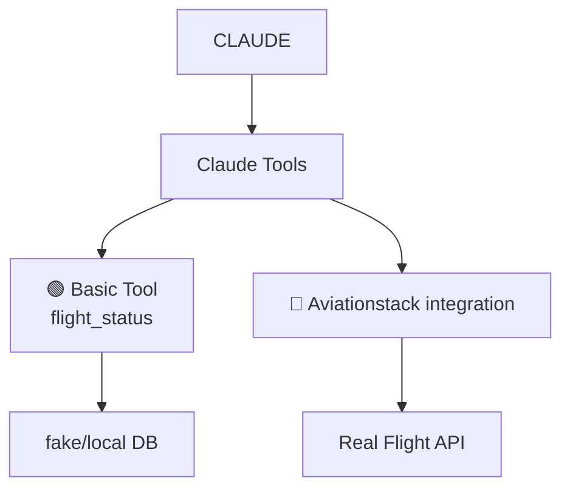

That's a much better architecture lesson because we're learning the difference between:

- Tool
- External Integration
- LLM
- Orchestration

### 9.4 One thing I especially like for your project

Aviationstack's API is a standard REST API returning JSON, and their documentation specifically describes Python integration. So we can learn the complete chain ourselves:

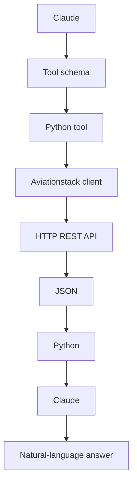

That is much more educational than hiding the API interaction behind a library.

And the free 100-request monthly allowance is enough for our initial development/testing, as long as we don't repeatedly hammer the API.

I would choose Aviationstack for our next stage. We can keep Amadeus as a future provider so you eventually learn how to design the platform for multiple aviation providers.

For now, don't create any files yet. The next step should be just setting up the Aviationstack API key securely in your existing `.env`/`settings.py`, while leaving the basic implementation untouched.

---

## 10. Committing to Aviationstack

> Go are we going to use this now?

Yes. 👍 I recommend we use Aviationstack now as the first real external aviation API in this project. But we'll do it very slowly and keep your existing basic code untouched.

### 10.1 Our next milestone

🟢 BASIC — untouched

- `src/tools/flight_status.py`
- `test_connection.py`

Then add:

🔵 AVIATIONSTACK — new

```
src/integrations/
└── aviationstack/
    ├── __init__.py
    ├── client.py
    └── tools/
        ├── __init__.py
        └── flight_search.py
```

### 10.2 Eventually

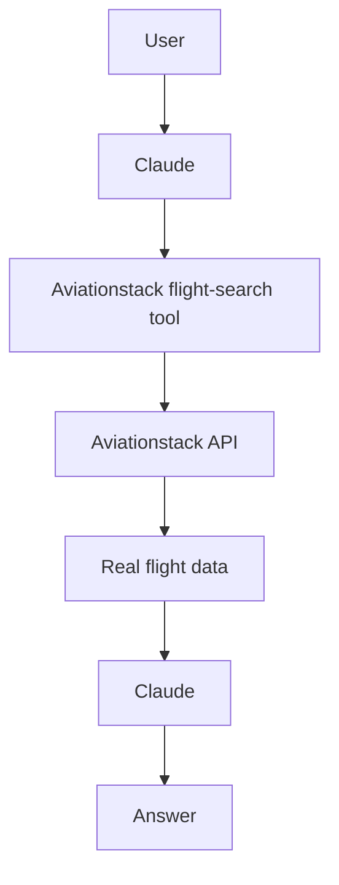

### 10.3 But not yet

Our next step is only API setup. We'll first get an Aviationstack API key and put it securely in your existing `.env`.

We will not touch:

- `flight_status.py`
- `test_connection.py`

Once the API key is configured and verified, we'll create `client.py`, then `flight_search.py`, one file at a time.

So yes: Aviationstack is our next development track. ✈️

---

## 11. Verifying the Aviationstack API key

Perfect. 👍

### 11.1 Step 4 — Verify the key is loaded

We're not calling Aviationstack yet. We only want to prove:

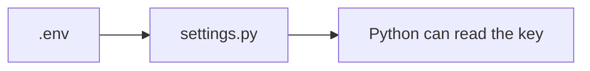

Temporarily add this to `test_connection.py`. At the top, add:

```python
from src.config.settings import AVIATIONSTACK_API_KEY
```

Then, temporarily, add:

```python
print(
    "Aviationstack API key loaded:",
    bool(AVIATIONSTACK_API_KEY)
)
```

So you should see:

```
Aviationstack API key loaded: True
```

**Why `bool()`?** We deliberately do not print the actual key. If the key is `abc123xyz...`, then `bool(AVIATIONSTACK_API_KEY)` returns `True` without exposing the secret. If the `.env` variable isn't loaded: `False`.

**🛑 Important** — after testing, remove those two temporary lines from `test_connection.py`. We don't want configuration testing mixed into your working Claude tool-calling example.

So:

1. Add the import.
2. Add the print.
3. Run `test_connection.py`.
4. Confirm you get `True`.
5. Remove both temporary lines.

Then tell me: *Step 4 done — True*

We'll then create our first Aviationstack directory/file, one tiny step at a time. ✈️

---

## 12. Verifying the key without touching the basic code

> ater updaing settings.py next?

Yes. 👍 After updating `settings.py`, the next step is exactly to verify that Python can read the new Aviationstack variable. But because you want to keep the basic code untouched, I would not modify your existing `test_connection.py` even temporarily.

Let's create a tiny separate verification file instead.

### 12.1 Step 4 — Create a temporary verification file

At the project root:

```
airline-ai-platform/
├── test_connection.py             🟢 EXISTING — DON'T TOUCH
├── test_aviationstack_config.py   🔵 NEW — TEMPORARY
└── ...
```

Create `test_aviationstack_config.py`. Put only this in it:

```python
from src.config.settings import AVIATIONSTACK_API_KEY


print(
    "Aviationstack API key loaded:",
    bool(AVIATIONSTACK_API_KEY)
)
```

Run:

```bash
python test_aviationstack_config.py
```

Expected:

```
Aviationstack API key loaded: True
```

We are not calling Aviationstack yet. We're only testing:

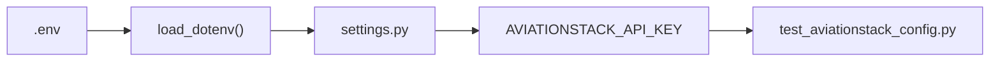

If you get `True`, tell me *Step 4 True*.

Then we'll delete the temporary verification file and move to the next tiny step: create the Amadeus/Aviationstack integration directory—sorry, Aviationstack integration directory—and nothing more. 😄

---

## 13. Cleanup and committing the config checkpoint

> done true is shown

Excellent! ✅ That confirms:

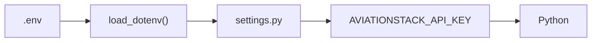

is working.

### 13.1 Step 5 — Clean up

Since the verification worked, delete the temporary file: `test_aviationstack_config.py`. We don't need it anymore.

Your project should go back to:

```
airline-ai-platform/
│
├── test_connection.py          🟢 Existing
│
├── src/
│   ├── config/
│   │   └── settings.py         🟢 Updated
│   │
│   └── tools/
│       └── flight_status.py    🟢 Untouched
│
└── .env                        🔐 Not committed
```

### 13.2 Then commit this checkpoint

Run:

```bash
git status
```

Review the changes. Then:

```bash
git add src/config/settings.py
git commit -m "Add Aviationstack API configuration"
```

And push:

```bash
git push
```

**🛑 Stop here.** Do not create the Aviationstack client yet.

Once you've committed and pushed successfully, tell me: *Step 5 done*

Then we'll create just one directory: `src/integrations/aviationstack/` — and I'll explain why we're putting the external API there before we write any API code.

---

## 14. Step 8 — testing the Aviationstack client configuration

Perfect. 👍 Step 8 — test the client configuration only.

We have now created `src/integrations/aviationstack/client.py`. Before we make a real API call, let's verify that the client can see the API key and has the correct base URL.

### 14.1 Add one method to `client.py`

Your current file is:

```python
import requests

from src.config.settings import AVIATIONSTACK_API_KEY


class AviationstackClient:

    BASE_URL = "https://api.aviationstack.com/v1"

    def __init__(self):
        self.api_key = AVIATIONSTACK_API_KEY
```

Now add only this method:

```python
    def is_configured(self) -> bool:
        return bool(self.api_key)
```

So the complete file becomes:

```python
import requests

from src.config.settings import AVIATIONSTACK_API_KEY


class AviationstackClient:

    BASE_URL = "https://api.aviationstack.com/v1"

    def __init__(self):
        self.api_key = AVIATIONSTACK_API_KEY

    def is_configured(self) -> bool:
        return bool(self.api_key)
```

**Why are we doing this?** We're separating configuration verification from API communication. `client.is_configured()` only answers *"Do I have an Aviationstack API key?"* It does not call Aviationstack.

### 14.2 Now create a temporary test

Create `test_aviationstack_client.py` at the project root:

```
airline-ai-platform/
├── test_connection.py
├── test_aviationstack_client.py   🔵 TEMPORARY
└── src/
    └── integrations/
        └── aviationstack/
            ├── __init__.py
            └── client.py
```

Put this in it:

```python
from src.integrations.aviationstack.client import AviationstackClient


client = AviationstackClient()

print("Aviationstack configured:", client.is_configured())
print("Aviationstack base URL:", client.BASE_URL)
```

Run:

```bash
python test_aviationstack_client.py
```

Expected:

```
Aviationstack configured: True
Aviationstack base URL: https://api.aviationstack.com/v1
```

**🛑 Stop here**

- Don't make the real API request yet.
- Don't create `flight_search.py` yet.

Once you get `Aviationstack configured: True`, tell me *Step 8 done*. Then we'll make our first real Aviationstack API call. ✈️

---

> can you plee printcomplete project hierrcy with Amadeus disctinguising basic and amadaus basic remail untouched

## 15. Step 8 — testing the Aviationstack client configuration (repeated)

Perfect. 👍 Step 8 — test the client configuration only.

We have now created `src/integrations/aviationstack/client.py`. Before we make a real API call, let's verify that the client can see the API key and has the correct base URL.

### 15.1 Add one method to `client.py`

Your current file is:

```python
import requests

from src.config.settings import AVIATIONSTACK_API_KEY


class AviationstackClient:

    BASE_URL = "https://api.aviationstack.com/v1"

    def __init__(self):
        self.api_key = AVIATIONSTACK_API_KEY
```

Now add only this method:

```python
    def is_configured(self) -> bool:
        return bool(self.api_key)
```

So the complete file becomes:

```python
import requests

from src.config.settings import AVIATIONSTACK_API_KEY


class AviationstackClient:

    BASE_URL = "https://api.aviationstack.com/v1"

    def __init__(self):
        self.api_key = AVIATIONSTACK_API_KEY

    def is_configured(self) -> bool:
        return bool(self.api_key)
```

**Why are we doing this?** We're separating configuration verification from API communication. `client.is_configured()` only answers *"Do I have an Aviationstack API key?"* It does not call Aviationstack.

### 15.2 Now create a temporary test

Create `test_aviationstack_client.py` at the project root:

```
airline-ai-platform/
├── test_connection.py
├── test_aviationstack_client.py   🔵 TEMPORARY
└── src/
    └── integrations/
        └── aviationstack/
            ├── __init__.py
            └── client.py
```

Put this in it:

```python
from src.integrations.aviationstack.client import AviationstackClient


client = AviationstackClient()

print("Aviationstack configured:", client.is_configured())
print("Aviationstack base URL:", client.BASE_URL)
```

Run:

```bash
python test_aviationstack_client.py
```

Expected:

```
Aviationstack configured: True
Aviationstack base URL: https://api.aviationstack.com/v1
```

**🛑 Stop here**

- Don't make the real API request yet.
- Don't create `flight_search.py` yet.

Once you get `Aviationstack configured: True`, tell me *Step 8 done*. Then we'll make our first real Aviationstack API call. ✈️

---

## 16. Fixing an `ImportError` on `AviationstackClient`

```
(.venv) kirankumar@kirans-MacBook-Pro airline-ai-platform % python test_aviationstack_client.py
Traceback (most recent call last):
  File "/Users/kirankumar/Documents/airline-ai-platform/test_aviationstack_client.py", line 1, in <module>
    from src.integrations.aviationstack.client import AviationstackClient
ImportError: cannot import name 'AviationstackClient' from 'src.integrations.aviationstack.client' (/Users/kirankumar/Documents/airline-ai-platform/src/integrations/aviationstack/client.py)
```

Good — this is a real Python import error, and the message tells us exactly where to look.

Your test is finding the correct file, `src/integrations/aviationstack/client.py`, but Python cannot find `AviationstackClient` inside that file. So the problem is inside `client.py`, not in the import statement.

### 16.1 Step 8A — Check `client.py`

Please open `src/integrations/aviationstack/client.py`. It should contain exactly this:

```python
import requests

from src.config.settings import AVIATIONSTACK_API_KEY


class AviationstackClient:

    BASE_URL = "https://api.aviationstack.com/v1"

    def __init__(self):
        self.api_key = AVIATIONSTACK_API_KEY

    def is_configured(self) -> bool:
        return bool(self.api_key)
```

Pay particular attention to `class AviationstackClient:` and `def is_configured(self) -> bool:`.

### 16.2 Then save the file

In VS Code: `⌘ + S`. Then run again:

```bash
python test_aviationstack_client.py
```

Expected:

```
Aviationstack configured: True
Aviationstack base URL: https://api.aviationstack.com/v1
```

### 16.3 Why this error happened

Python successfully did `from src.integrations.aviationstack.client import ...`, so it found `src/integrations/aviationstack/client.py`. But then it looked inside that module for `AviationstackClient` and didn't find it. That's why the error is:

```
ImportError: cannot import name 'AviationstackClient'
```

Don't change `test_aviationstack_client.py` yet. Fix/check `client.py` first and run it again.

---

## 17. Step 9 — first successful Aviationstack API call

Perfect. ✅ The API connection is working. This response:

```json
{
    "pagination": {
        "limit": 100,
        "offset": 0,
        "count": 0,
        "total": 0
    },
    "data": []
}
```

is not a Python error. It means:

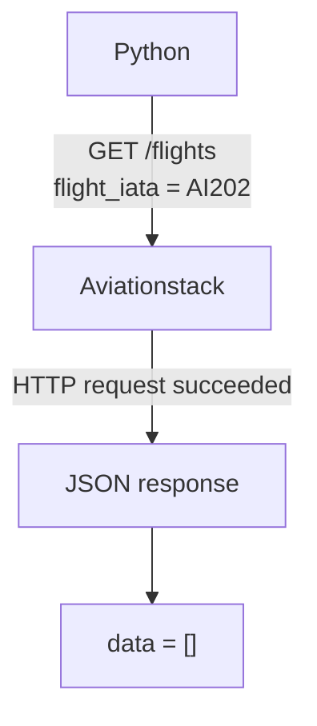

### 17.1 What does `data: []` mean?

It means Aviationstack returned zero matching flight records for AI202 under the query/availability your account currently provides. The important thing is `count = 0` and `total = 0`, not:

- ❌ connection failed
- ❌ API key invalid
- ❌ Python error

So we've successfully completed Step 9:

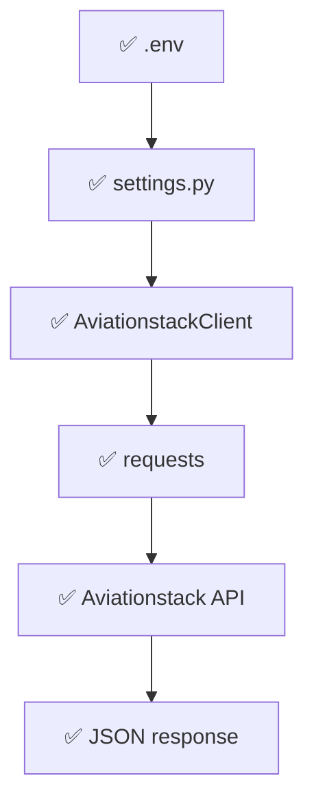

---

## 18. Why raw API responses shouldn't reach Claude

Now let's learn something important. Our original fake tool returned:

```json
{
    "status": "Delayed",
    "delay_minutes": 45,
    "gate": "B12"
}
```

But the real API returns a completely different structure:

```json
{
    "pagination": {...},
    "data": [...]
}
```

This is exactly why we separated the integration from the Claude tool. We don't want Claude to know anything about Aviationstack's raw response format. Eventually we'll have:

```mermaid
flowchart TD
    C1[Claude] --> TOOL["flight_search TOOL"]
    TOOL --> INTEG["Aviationstack integration"]
    INTEG --> RAW["Raw Aviationstack JSON"]
    RAW --> XFORM["Our Python code transforms it"]
    XFORM --> CLEAN["Clean flight result"]
    CLEAN --> C2[Claude]
```

For example, our tool could eventually give Claude:

```json
{
    "flight_number": "AI202",
    "status": "Delayed",
    "departure": "HYD",
    "arrival": "DEL"
}
```

instead of exposing the entire Aviationstack response. That is an important enterprise integration pattern:

> External API response ≠ AI tool response.

### 18.1 One thing I want to do before writing more code

Let's test with a flight that Aviationstack actually returns data for, rather than assuming AI202 exists in its current dataset. We can use Aviationstack's API response to identify a live flight and then test our client against that.

Don't change any code yet. Your current `client.py` is working. 👍 Tell me next, and we'll do the next small step: make our test retrieve available flights instead of asking specifically for AI202.

---

## 19. What makes this project unique

> befere we procees wanted to understand what unique we are building ?

Absolutely. Before we write another line of code, you should know exactly what we're building. Otherwise it becomes another "Claude gave me code, I copied it" exercise. 😄

What we're building is not another flight-search chatbot.

**✈️ Our project: Airline AI Platform.** The goal is to build a small but enterprise-style Agentic AI architecture for the airline/travel domain. The unique part is the architecture and learning progression, not simply using an aviation API.

### 19.1 The big picture

```mermaid
flowchart TD
    USER[USER] --> CLAUDE1["CLAUDE<br/>AI BRAIN"]
    CLAUDE1 -->|"understands intent"| AGENT["AGENT /<br/>ORCHESTRATOR"]
    AGENT --> FS["Flight Status Tool"]
    AGENT --> FSE["Flight Search Tool"]
    AGENT --> FUT["Future Tools"]
    FS --> LOCAL["Local/Data Source"]
    FSE --> AVS["Aviationstack API"]
    AVS --> REAL["Real flight data"]
    LOCAL --> NORM["Result Normalizer"]
    REAL --> NORM
    NORM --> CLAUDE2[CLAUDE]
    CLAUDE2 --> ANSWER["User Answer"]
```

We're building this one layer at a time.

### 19.2 What makes OUR project interesting?

There are 5 things I want you to learn through this project.

#### 1. Claude is not the application

This is probably the most important architectural lesson. We currently have:

```mermaid
flowchart TD
    C1[Claude] --> TU[tool_use]
    TU --> PY[Python]
    PY --> FN["flight_status_lookup()"]
```

But eventually:

```mermaid
flowchart TD
    C2[Claude] --> AG[Agent]
    AG --> TR["Tool registry"]
    TR --> EI["External integrations"]
    EI --> AS2["Airline systems"]
```

Claude becomes the reasoning layer, not the entire application.

#### 2. Tools and integrations are separated

We're deliberately creating `src/tools/` and `src/integrations/`. These have different responsibilities.

**Tools** — `src/tools/` means: *what capabilities can my AI agent use?* For example:

- flight_status
- flight_search
- booking
- cancel_booking
- check_baggage

**Integrations** — `src/integrations/` means: *how does my application communicate with external systems?* For example:

- aviationstack/
- amadeus/
- weather_api/
- payment_api/

This means later we can change:

```mermaid
flowchart LR
    A[Aviationstack] -.->|swap provider| B[Amadeus]
```

without redesigning the whole agent. That's an enterprise architecture pattern.

#### 3. We're not going to expose raw API responses to Claude

You just saw this:

```json
{
    "pagination": {...},
    "data": []
}
```

That's an Aviationstack-specific response. Our AI shouldn't have to understand Aviationstack's implementation details. Instead we'll eventually create a clean internal model:

```mermaid
flowchart TD
    AV[Aviationstack] --> RJ["Raw JSON"]
    RJ --> NRM[Normalizer]
    NRM --> FM["Our Flight model"]
    FM --> CL3[Claude]
```

For example:

```json
{
    "flight_number": "AI202",
    "status": "Delayed",
    "origin": "HYD",
    "destination": "DEL"
}
```

That gives us provider independence.

#### 4. Eventually we'll make the agent intelligent about which tool to use

Imagine the user says: *"Is AI202 delayed?"* Claude decides: `flight_status`.

But: *"Find me flights from Hyderabad to Delhi tomorrow."* Claude decides: `flight_search`.

Later: *"My flight is cancelled. Find me another flight."* Claude may need:

```mermaid
flowchart TD
    FST[flight_status] --> FSR[flight_search]
    FSR --> REC[recommendation]
```

That's where it becomes Agentic, rather than simply: `question → API → answer`.

#### 5. Eventually we'll add RAG + ML + governance

This is where the project becomes much more aligned with the AI Architect / Agentic AI role you're preparing for. Eventually:

```mermaid
flowchart TD
    PLATFORM["AIRLINE AI PLATFORM"] --> AGENTIC["AGENTIC AI"]
    PLATFORM --> RAG[RAG]
    PLATFORM --> ML[ML]

    AGENTIC --> AG1["Flight search"]
    AGENTIC --> AG2["Flight status"]
    AGENTIC --> AG3[Rebooking]
    AGENTIC --> AG4["Customer service"]

    RAG --> R1["Airline policies"]
    RAG --> R2["Baggage policies"]
    RAG --> R3["Travel regulations"]

    ML --> M1["Delay prediction"]
    ML --> M2["Demand prediction"]
    ML --> M3["Anomaly detection"]

    AGENTIC --> GOV[GOVERNANCE]
    RAG --> GOV
    ML --> GOV
    GOV --> G1[PII]
    GOV --> G2[Audit]
    GOV --> G3[Guardrails]
    GOV --> G4["Human approval"]
```

We are nowhere near implementing all of that yet. That's intentional.

### 19.3 What we're building first

Our current milestone is simply:

**PHASE 1**

```mermaid
flowchart TD
    P1C[Claude] --> P1T["Tool calling"]
    P1T --> P1P[Python]
    P1P --> P1A[Aviationstack]
    P1A --> P1D["Real aviation data"]
```

Then, **PHASE 2**:

```mermaid
flowchart TD
    P2C[Claude] --> P2M["Multiple tools"]
    P2M --> P2A[flight_status]
    P2M --> P2B[flight_search]
```

Then, **PHASE 3**:

```mermaid
flowchart TD
    P3A[Agent] --> P3B["Tool selection"]
    P3B --> P3C[Orchestration]
```

Then, **PHASE 4**:

```mermaid
flowchart TD
    P4A[Agent] --> P4B[Tools]
    P4A --> P4C[RAG]
    P4A --> P4D[ML]
    P4A --> P4E["External APIs"]
```

Then, **PHASE 5**:

```mermaid
flowchart TD
    P5A["Enterprise architecture"] --> P5B[Guardrails]
    P5A --> P5C[Observability]
    P5A --> P5D[Audit]
    P5A --> P5E["Human-in-the-loop"]
    P5A --> P5F[Compliance]
```

### 19.4 And there is one especially important thing

We're not replacing your existing `flight_status.py`. That is our learning baseline. You now have:

```mermaid
flowchart LR
    BASIC["🟢 BASIC<br/>flight_status.py"] --> FAKE["fake/local data"]
```

And we're building:

```mermaid
flowchart LR
    REALINT["🔵 REAL INTEGRATION<br/>Aviationstack"] --> REALDATA["real external data"]
```

So you can actually compare FAKE TOOL vs REAL API TOOL and understand exactly what changes when an Agentic AI system moves from a demo to a real integration.

That's what I consider the unique value of this project:

> A provider-independent, Claude-powered airline Agentic AI platform where we progressively evolve from a simple tool-calling demo into an enterprise architecture with real aviation data, RAG, ML, orchestration, guardrails, and governance.

And we're going to build it slowly enough that you understand every layer, rather than letting an LLM generate 30 files and hoping they work. 😄

---

## 20. How this compares to MakeMyTrip, Yatra, and Qatar Airways

> site like make my trip , Yatra, quatar airline are much adnace rt?

Yes — much more advanced than what we are building right now, and that's actually a good thing. 😄

For example, MakeMyTrip has real-time reservation/availability data, dynamic airfare, filters, booking, and a large inventory. Yatra similarly supports one-way, round-trip and multi-city searches, multiple airlines, fare comparisons, filters, booking, cancellations/rescheduling, etc.

And Qatar Airways goes beyond search/booking into the airline's own reservation ecosystem: managing bookings, changing/cancelling flights, check-in, seats, meals, upgrades, add-ons and trip notifications.

### 20.1 So what are we building compared with them?

Think of it this way:

```mermaid
flowchart TD
    ROOT["MakeMyTrip / Yatra / Qatar"] --> BP["Booking Platform"]
    ROOT --> AP["Airline Platform"]

    BP --> BP1[Search]
    BP --> BP2[Pricing]
    BP --> BP3[Inventory]
    BP --> BP4[Payments]
    BP --> BP5[Booking]
    BP --> BP6[Cancellation]
    BP --> BP7["Customer service"]

    AP --> AP1[Reservations]
    AP --> AP2[PNR]
    AP --> AP3["Check-in"]
    AP --> AP4["Seat management"]
    AP --> AP5[Baggage]
    AP --> AP6["Disruption handling"]
    AP --> AP7[Loyalty]
```

Our project is initially much smaller:

```mermaid
flowchart TD
    PLATFORM2["OUR AIRLINE AI PLATFORM"] --> CLAUDE3[Claude]
    CLAUDE3 --> AGENTTOOLS["Agent / Tools"]
    AGENTTOOLS --> FSTAT["Flight Status"]
    AGENTTOOLS --> FSEARCH["Flight Search"]
    AGENTTOOLS --> FUTURE["Future..."]
    FSTAT --> BASICIMPL["Basic/local implementation"]
    FSEARCH --> AVSAPI["Aviationstack API"]
```

### 20.2 But here's the interesting part

We are not trying to build another MakeMyTrip. We're building the AI intelligence layer that could sit on top of systems like these. Eventually:

```mermaid
flowchart TD
    U1[USER] --> AGENT2["AI AGENT<br/>CLAUDE"]
    AGENT2 --> SRCH[Search]
    AGENT2 --> STAT[Status]
    AGENT2 --> POL[Policies]
    SRCH --> API1["Flight API"]
    STAT --> API2["Flight API"]
    POL --> RAG2[RAG]
    API1 --> REASON["AI Reasoning"]
    API2 --> REASON
    RAG2 --> REASON
    REASON --> REC2[Recommendation]
    REC2 --> U2[USER]
```

For example, a future user could say:

> "My flight from Hyderabad to Doha tomorrow is delayed. Find me the best alternative under ₹40,000, preferably Qatar Airways, and tell me whether my baggage allowance will change."

That's dramatically more interesting than: *"Search flights from HYD to DOH."*

The agent would potentially need to:

1. Understand the request
2. Check flight status
3. Search alternatives
4. Apply price constraint
5. Apply airline preference
6. Retrieve baggage policy using RAG
7. Compare options
8. Explain recommendation
9. Ask for approval before booking

That is where our project becomes Agentic AI.

So don't worry that MakeMyTrip/Yatra/Qatar are far ahead. We're not competing with their entire product. We're learning how to architect the AI layer that can intelligently interact with complex travel systems.

And that's why I want us to keep going slowly. We are currently only at:

```mermaid
flowchart TD
    C4[Claude] --> T1[Tool]
    T1 --> P1[Python]
    P1 --> AV2[Aviationstack]
    AV2 --> RD["Real flight data"]
```

That's our foundation. We don't need to jump to booking, payments, PNR, or multi-agent orchestration yet.

---

## 21. Mapping this project to the job description

> its i shared JD related?

Yes — very much related to the JD you shared. In fact, the way we're structuring this project is specifically aimed at demonstrating the capabilities mentioned in that JD.

The JD you shared emphasized:

- AI architecture experience with Python and ML frameworks
- Travel / airline industry AI solutions
- Design and develop Agentic AI systems
- Lead AI architecture
- Implement ML models
- Mentor teams
- Ensure compliance

Our project maps to those requirements like this:

| JD requirement | What we'll build/learn |
|---|---|
| Python | Entire platform is Python |
| Travel / Airline AI | Real airline/flight domain |
| Agentic AI | Claude tool calling → agents → orchestration |
| AI architecture | Separate tools, integrations, agents, orchestration |
| External airline systems | Aviationstack initially; potentially Amadeus later |
| ML models | Later: delay prediction / demand prediction |
| RAG | Airline policies, baggage, cancellation, disruption rules |
| Compliance | PII, audit, guardrails, human approval |
| Architecture leadership | ADRs, diagrams, separation of responsibilities |
| Team mentoring | We'll document why each component exists |

### 21.1 And this is why I asked you not to build a MakeMyTrip clone

A MakeMyTrip-like product would be mostly:

```mermaid
flowchart TD
    S1[Search] --> S2[Inventory]
    S2 --> S3[Pricing]
    S3 --> S4[Booking]
    S4 --> S5[Payment]
```

That's a large travel-commerce platform. Your JD is much more interested in:

```mermaid
flowchart TD
    ARCH["AI ARCHITECTURE"] --> AGENT3["AI AGENT"]
    AGENT3 --> T2[Tools]
    AGENT3 --> R2[RAG]
    AGENT3 --> M2[ML]
    T2 --> API3["Airline APIs"]
    R2 --> POL2[Policies]
    M2 --> PRED[Predictions]
    API3 --> DEC["AI Decision"]
    POL2 --> DEC
    PRED --> DEC
    DEC --> HU["Human / User"]
```

That is much closer to the JD. And eventually I want you to be able to explain in an interview:

> "I designed a provider-independent airline Agentic AI architecture where the LLM performs intent reasoning, tools expose controlled capabilities, external aviation integrations are isolated from the agent layer, RAG provides policy grounding, ML models provide predictive intelligence, and governance controls the resulting actions."

That's a much stronger AI Architect story than: *"I built a chatbot that searches flights."*

So yes — we're building this project specifically with that JD in mind, while making sure you actually understand every layer rather than just generating code.
