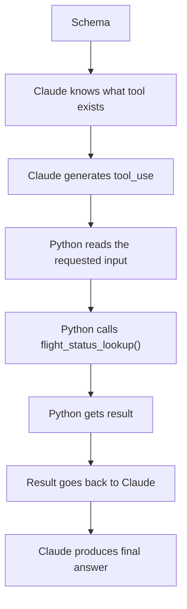
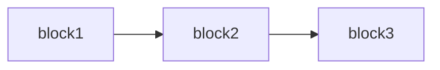
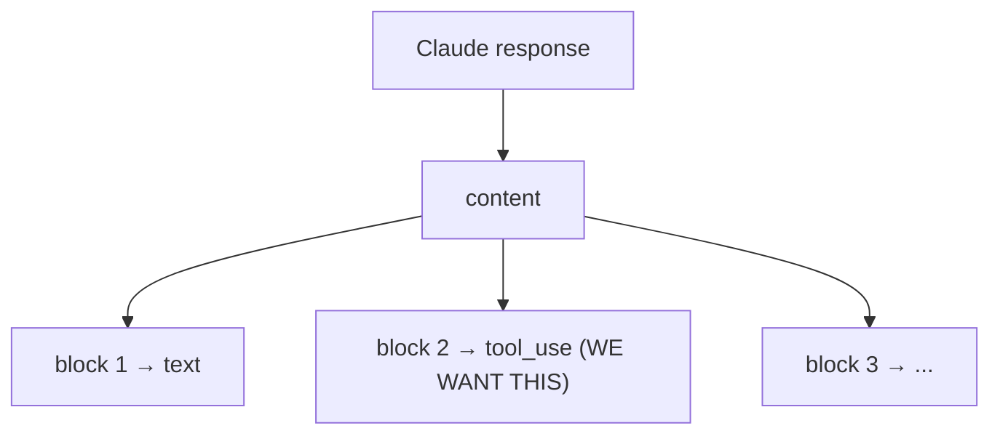
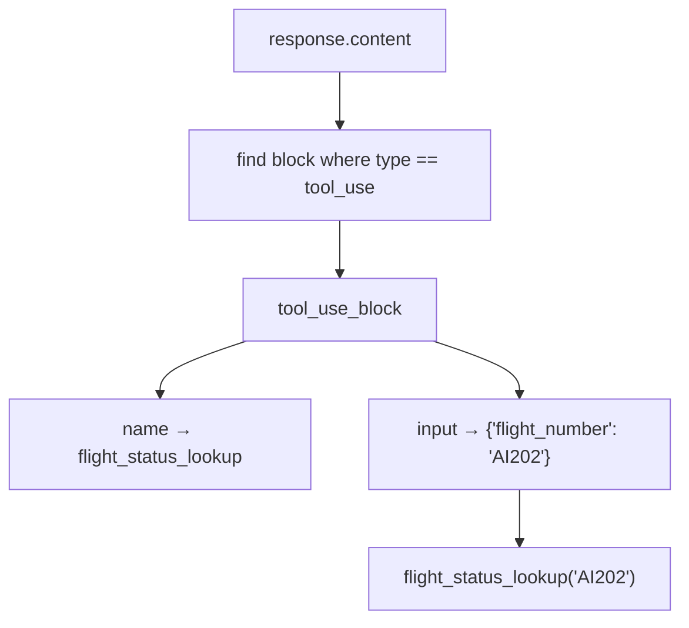
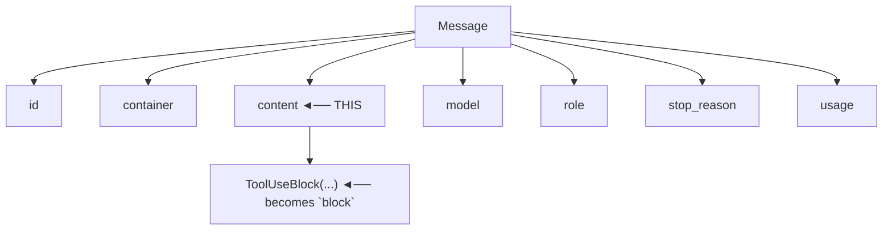
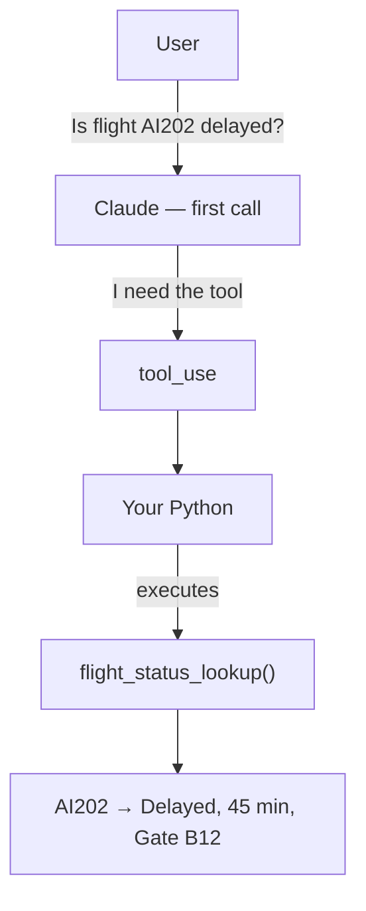
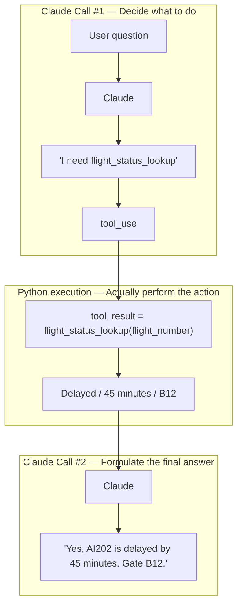
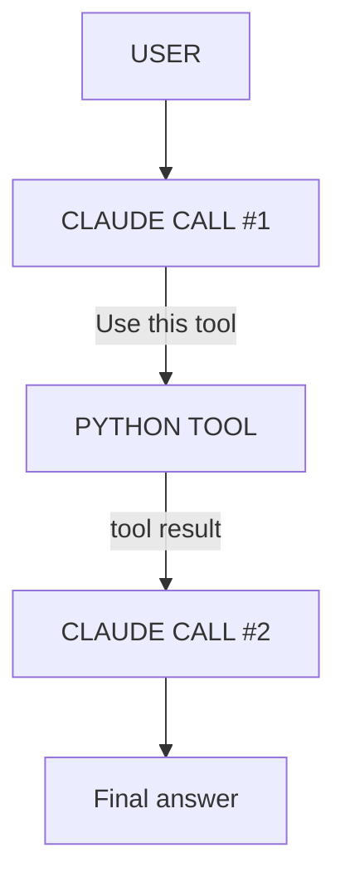
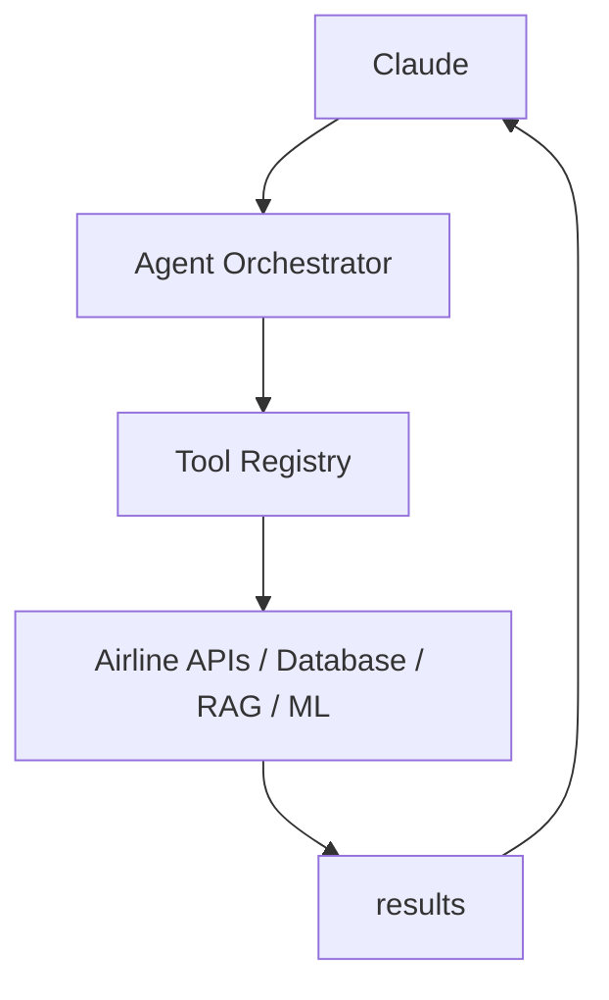

# Running Notes — Claude Tool Use

## 1. The three important locations

There are three different things to distinguish:

| # | What | Where |
|---|------|-------|
| 1 | Schema definition | `flight_status.py` — `flight_status_tool_schema: ToolParam = {...}` |
| 2 | Schema given to Claude | `test_connection.py` — `tools=[flight_status_tool_schema]` |
| 3 | Actual Python function execution | `test_connection.py` — `tool_result = flight_status_lookup(flight_number)` |

### The overall flow



This version specifically addresses the two Pylance errors already encountered.

---

## 2. Understanding `tool_use_block = next(...)`

```python
tool_use_block = next(
    block
    for block in response.content
    if block.type == "tool_use"
)
```

This is an important line because it sits right at the boundary between Claude's response and the Python code. Let's go slowly.

### 2.1 What is `response.content`?

Earlier we did:

```python
response = client.messages.create(...)
```

Claude sends back a response, and that response can contain different types of blocks. For example, for the question *"Is flight AI202 delayed?"*, Claude may decide it needs to use `flight_status_lookup`, so the response could contain a `tool_use` block conceptually like:

```python
response.content
[
    TextBlock(...),
    ToolUseBlock(...)
]
```

### 2.2 `for block in response.content`

This means: go through every block inside Claude's response.



### 2.3 `if block.type == "tool_use"`

For every block, we ask: *is this block a tool_use block?*

- `block1.type = "text"` → not what we're looking for
- `block2.type = "tool_use"` → ✅ that's the one we want

### 2.4 What does `next()` do?

`next(...)` means: *give me the first item that matches what I'm looking for.*

So the full expression means: *search through `response.content` and give me the first block whose type is `"tool_use"`.*

### 2.5 The long-form equivalent

```python
tool_use_block = None

for block in response.content:
    if block.type == "tool_use":
        tool_use_block = block
        break
```

Step by step:

1. `tool_use_block = None` — start with nothing.
2. `for block in response.content:` — look at each Claude response block.
3. `if block.type == "tool_use":` — check whether this is the tool request.
4. `tool_use_block = block` — save that tool request.
5. `break` — stop searching, we found it.

### 2.6 Why do we need this?

Because Claude's response isn't necessarily just a `tool_use` block and nothing else — it's a collection of content blocks:



We need to locate that specific `tool_use` block. So `next(...)` is basically saying:

> "Claude, give me the first tool request you generated." 😄

### 2.7 Once we have `tool_use_block`

```python
print(tool_use_block.name)
# flight_status_lookup

print(tool_use_block.input)
# {"flight_number": "AI202"}
```

Then we extract:

```python
flight_number = str(tool_use_block.input["flight_number"])
tool_result = flight_status_lookup(flight_number)
```

### 2.8 The entire chain



### 2.9 One Python concept to remember

```python
next(
    item
    for item in collection
    if condition
)
```

Means: *find the first item in `collection` that satisfies `condition`.* This pattern shows up all over Python, not just in Agentic AI.

### 2.10 Where is `block` in the real response?

Actual printed Claude response:

```python
Message(
    id='msg_011CeLTqxgDife7mswCcwgQo',
    container=None,
    content=[
        ToolUseBlock(
            id='toolu_01VZAn2kTfyxsrP8c7oZhs9Y',
            caller=DirectCaller(type='direct'),
            input={'flight_number': 'AI202'},
            name='flight_status_lookup',
            type='tool_use',
            toolset_name=None
        )
    ],
    model='claude-sonnet-4-5-20250929',
    role='assistant',
    stop_reason='tool_use',
    ...
)
```



Since there is one item in that list, Python assigns it to the loop variable `block`. At that moment `block` is essentially:

```python
ToolUseBlock(
    id='toolu_01VZAn2kTfyxsrP8c7oZhs9Y',
    input={'flight_number': 'AI202'},
    name='flight_status_lookup',
    type='tool_use'
)
```

Read the `next()` line like English: *go through every block inside `response.content`; if the block's type is `"tool_use"`, return that block.* The condition `block.type == "tool_use"` evaluates to `"tool_use" == "tool_use"` → ✅ `True`, so `tool_use_block = block`.

Now:

```python
tool_use_block.name    # flight_status_lookup
tool_use_block.input   # {"flight_number": "AI202"}
tool_use_block.input["flight_number"]  # AI202
flight_status_lookup("AI202")          # executes the function
```

### 2.11 The key concept

`block` is **not** something Claude created — it's just a Python loop variable name. This would work identically:

```python
for xyz in response.content:
    print(xyz)

for response_item in response.content:
    print(response_item)
```

`for block in response.content` simply means: *"For each item in Claude's content list, temporarily call that item `block`."*

---

## 3. Why do we call Claude twice?

> Q: Why call Claude again for the final response — we already called it at the start?

The answer: **the first Claude call doesn't have the flight result yet.** This is the most important concept in the whole tool-calling flow.

### 3.1 First Claude call

```python
response = client.messages.create(...)
```

At this point Claude knows the user's question ("Is flight AI202 delayed?") and the available tool (`flight_status_lookup`). Claude thinks: *"I need the flight status, I'll request the tool."* It returns a `tool_use` block — it has **not** received the actual flight status yet.

### 3.2 Python executes the tool

```python
tool_result = flight_status_lookup("AI202")
# {"status": "Delayed", "delay_minutes": 45, "gate": "B12"}
```

Now Python knows the answer, but Claude doesn't.



At this point: Python knows the result ✅, Claude doesn't know the result yet ❌.

### 3.3 Therefore we call Claude again

```python
final_response = client.messages.create(
    ...,
    # includes:
    {
        "type": "tool_result",
        "tool_use_id": tool_use_block.id,
        "content": str(tool_result),
    }
)
```

This isn't simply repeating the first call — we're giving Claude the missing information: *"You asked me to run `flight_status_lookup` for AI202. I ran it. Here is the result."*

Claude now receives the user's question, its own previous response, and the tool result — and can finally answer.

### 3.4 Why there are two Claude calls



### 3.5 Why can't Python just answer the user?

It could — `print(tool_result)` gives `{'status': 'Delayed', 'delay_minutes': 45, 'gate': 'B12'}`, but that's not very user-friendly. Claude turns structured data into a natural response:

> "Yes, flight AI202 is delayed by 45 minutes. The current gate is B12."

And later, Claude can do much more sophisticated reasoning.

### 3.6 The fundamental Agentic pattern



### 3.7 The critical insight

**Claude does not execute your Python tool. Your application is the orchestrator between Claude and the tool.**

This simple example is teaching the foundation of an Agentic AI architecture. Later, instead of `Claude → Python function`, we'll have:



And that's where the Airline AI Platform starts becoming a real Agentic AI system.
