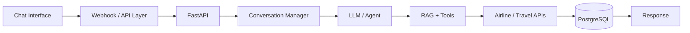

# AI Conversational Travel Assistant

*Chatbot Portfolio Project — Agentic AI + RAG + Airline AI Platform*
*WhatsApp-style portfolio demonstration*

## Project Overview

- AI-powered conversational travel assistant connected to an Airline AI Platform.
- Natural-language flight discovery, travel questions, itinerary assistance, and API-backed workflows.
- LLM-driven conversational layer with tool calling, RAG, conversation state, and fallback handling.
- Portfolio prototype demonstrating a WhatsApp-style chat experience.

## Chatbot Portfolio Demo — WhatsApp-style

**✈️ Airline AI Assistant**

> **USER:** Hi, I need a flight from Hyderabad to Dubai tomorrow.
>
> **AI:** Sure. What cabin would you prefer — Economy or Business?
>
> **USER:** Economy. Prefer the lowest fare.
>
> **AI:** Got it. I'll search for the lowest available Economy options from HYD to DXB.
>
> **AI:** I found several options. Would you like the cheapest, fastest, or all available options?
>
> **USER:** Show the cheapest option.
>
> **AI:** Here's the best match from the available results:
> HYD → DXB | Economy | Lowest-fare option
>
> **USER:** Also tell me the baggage allowance.
>
> **AI:** I'll retrieve the baggage information for that itinerary and summarize it for you.

## Technical Architecture

## Key Capabilities

- Conversational workflow and dialogue-state management
- LLM responses and prompt engineering
- Tool/function calling for flight and travel services
- RAG for travel policies and airline information
- REST API integration and backend orchestration
- PostgreSQL conversation/user-state persistence
- Fallback handling, validation, retries, logging, and graceful errors
- Agentic orchestration for multi-step travel requests
